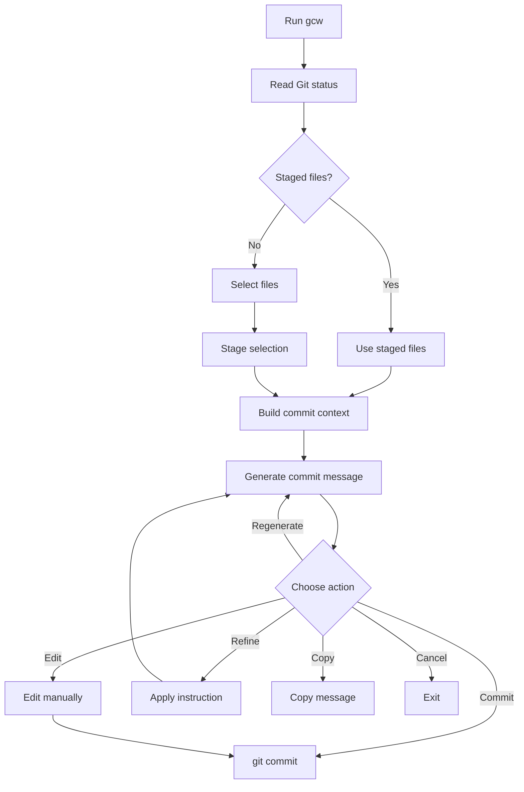
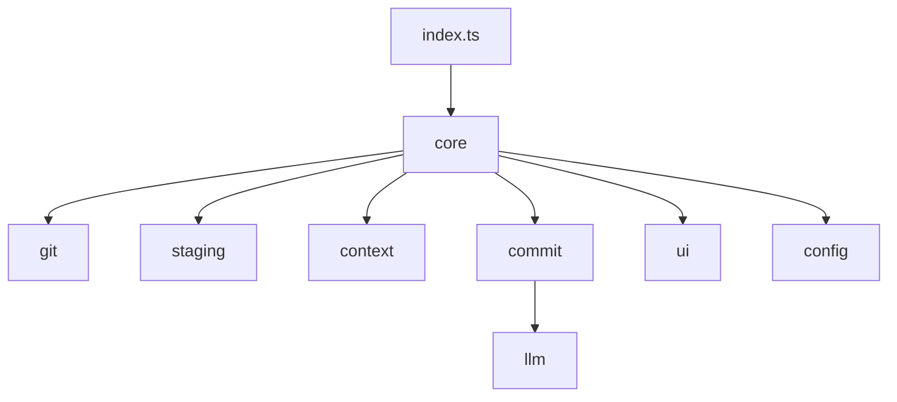

# git-commit-writer

Interactive CLI for generating clean Conventional Commit messages from staged Git changes.

`git-commit-writer` exposes the `gcw` command. It helps developers stage changes, generate a commit message with an LLM, then commit, edit, regenerate, refine, or copy the result.

---

## Features

- Generate Conventional Commit messages from Git diffs
- Select and stage files interactively
- Use already staged files directly
- Add issue references from CLI args or branch names
- Refine, regenerate, edit, copy, or commit messages
- Supports OpenAI and Ollama
- Extensible LLM provider interface

---

## Install

```bash
git clone <repo-url>
cd git-commit-writer
npm install
npm run build
npm link
```

Verify:

```bash
gcw --help
```

---

## Usage

Run inside a Git repository:

```bash
gcw
```

With issue references:

```bash
gcw 123
gcw 42 99
```

Example output:

```text
feat(cli): add staged file selection

refs #123
```

---

## Workflow



---

## Configuration

Edit:

```text
src/config/config.ts
```

Example:

```ts
export const config = {
  llm: {
    provider: "openai",
    reasoningModel: "gpt-4o-mini",
    generationModel: "gpt-4o-mini",
  },
};
```

### OpenAI

```bash
export OPENAI_API_KEY="your_api_key"
```

### Ollama

```ts
llm: {
  provider: "ollama",
  reasoningModel: "llama3.1",
  generationModel: "llama3.1",
}
```

Make sure Ollama is running:

```bash
ollama serve
```

---

## Architecture



```text
src/
  index.ts      CLI entrypoint
  core/         orchestration
  git/          git status, diff, commit metadata
  staging/      file selection and staging
  context/      prompt context builder
  commit/       commit message generation
  llm/          OpenAI/Ollama providers
  config/       runtime config
  ui/           terminal UI helpers
```

---

## Scripts

```bash
npm run build      # compile TypeScript
npm run start      # run dist/index.js
npm run lint       # lint project
npm run lint:fix   # fix lint issues
npm run check      # lint + build
npm run clean      # remove dist
```

---

## Add a Provider

Implement the `LLM` interface:

```ts
export interface LLM {
  complete(prompt: string): Promise<string>;
  stream(
    prompt: string,
    onText: (text: string) => void,
  ): Promise<string>;
}
```

Then register it in `src/llm/index.ts` and select it in `src/config/config.ts`.

---

## Privacy

`gcw` sends staged Git context to the configured LLM provider.

Before committing sensitive work, check what is staged:

```bash
git diff --staged
```

Do not stage secrets, tokens, credentials, private keys, or confidential data.
