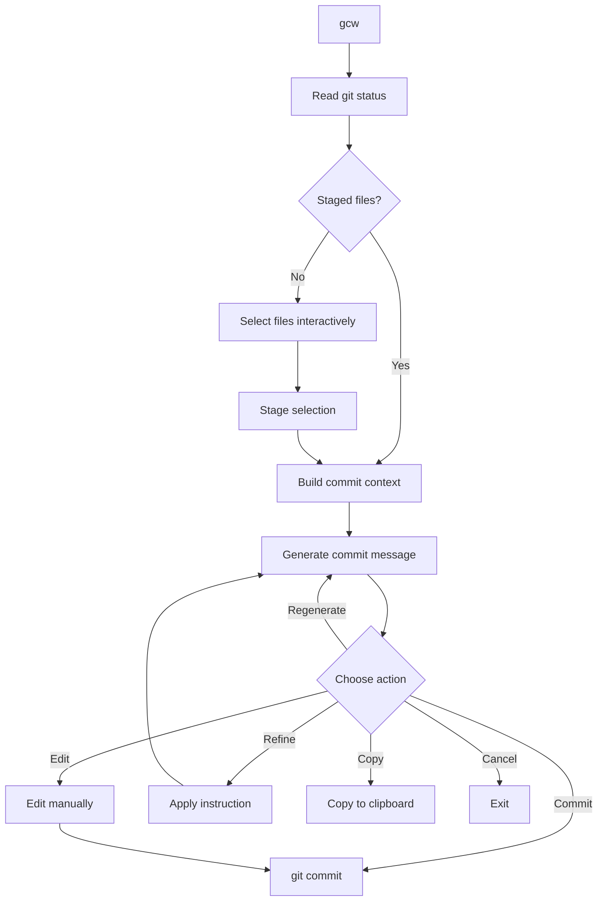

# git-commit-writer

A CLI that generates [Conventional Commit](https://www.conventionalcommits.org/) messages from staged Git changes using LLMs.

You stage your changes, run `gcw`, and get a properly formatted commit message. You can then commit it directly, edit it, regenerate, refine with instructions, or copy it to your clipboard.


[](https://nodejs.org/)
[](https://www.typescriptlang.org/)
[](https://conventionalcommits.org)


---

## Features

- Generate Conventional Commit messages from git diffs
- Interactive file staging or use of already staged files
- Fast mode: stage everything, generate, and commit in one step
- Issue references from CLI arguments or branch name detection
- Iterative workflow: regenerate, refine, edit, copy, or commit
- Supports OpenAI and Ollama (local LLMs)
- Extensible LLM provider interface

---

## Install

```bash
git clone https://github.com/AlexanderT02/git-commit-writer.git
cd git-commit-writer
npm install
npm run build
npm link
```

Verify:

```bash
gcw --help
```

---

## Usage

Run inside any Git repository:

```bash
gcw
```

With issue references:

```bash
gcw 123
gcw 42 99
```

### Fast mode

Stage all changes, generate a commit message, and commit immediately — no prompts, no menus:

```bash
gcw -f
gcw --fast
```

Works with issue references too:

```bash
gcw -f 123
```

Example output:

```
feat(cli): add staged file selection

refs #123
```

### Interactive workflow

In the default interactive mode, after generating a message you get these options:

| Action       | What it does                                    |
|--------------|------------------------------------------------|
| Commit       | Run `git commit` with the generated message     |
| Edit         | Modify the message manually before committing   |
| Regenerate   | Generate a new message from scratch             |
| Refine       | Adjust the message with a specific instruction  |
| Copy         | Copy to clipboard                               |
| Cancel       | Exit without committing                         |



---

## Configuration

Edit `src/config/config.ts`:

### OpenAI

```typescript
export const config = {
  llm: {
    provider: "openai",
    reasoningModel: "gpt-4o-mini",
    generationModel: "gpt-4o-mini",
  },
};
```

```bash
export OPENAI_API_KEY="your_api_key"
```

### Ollama

```typescript
export const config = {
  llm: {
    provider: "ollama",
    reasoningModel: "llama3.1",
    generationModel: "llama3.1",
  },
};
```

Make sure Ollama is running:

```bash
ollama serve
```

Using Ollama keeps everything local — no data leaves your machine.

---

## Architecture

```
src/
  index.ts        CLI entrypoint
  core/           Orchestration logic
  git/            Git status, diff, commit metadata
  staging/        File selection and staging
  context/        Prompt context builder
  commit/         Commit message generation
  llm/            LLM providers (OpenAI, Ollama)
  config/         Runtime configuration
  ui/             Terminal UI helpers
```

### Adding a provider

Implement the `LLM` interface:

```typescript
export interface LLM {
  complete(prompt: string): Promise<string>;
  stream(
    prompt: string,
    onText: (text: string) => void,
  ): Promise<string>;
}
```

Register it in `src/llm/index.ts` and select it in `src/config/config.ts`.

---

## Scripts

| Command            | Description          |
|--------------------|----------------------|
| `npm run build`    | Compile TypeScript   |
| `npm run start`    | Run dist/index.js    |
| `npm run lint`     | Lint project         |
| `npm run lint:fix` | Fix lint issues      |
| `npm run check`    | Lint + build         |
| `npm run clean`    | Remove dist/         |

---

## Privacy

`gcw` sends staged git context to the configured LLM provider. Before committing sensitive work:

```bash
git diff --staged
```

Do not stage secrets, tokens, credentials, private keys, or confidential data.