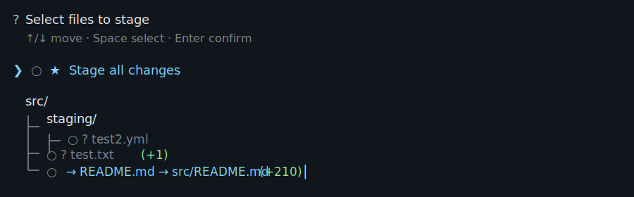
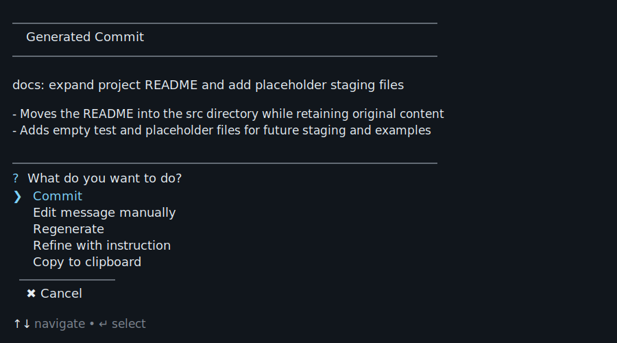

# Git Writer

Git Writer is a small CLI that turns local Git changes into useful text.

It can generate:

- [Conventional Commit](https://www.conventionalcommits.org/) messages from interactively selected or already staged files
- Pull request titles and Markdown descriptions from branch diffs
- GitHub pull requests when the GitHub CLI is installed and authenticated
- Local usage statistics for generated output

Git Writer uses OpenAI by default, but the LLM provider is configurable. You can switch to Ollama, Gemini, or add another provider.

Use `gw --help` for the full command reference.

[](https://nodejs.org/)
[](https://www.typescriptlang.org/)
[](https://www.conventionalcommits.org/)





---

## Requirements

- Node.js `>= 22`
- Git
- One configured LLM provider:
  - OpenAI with an API key
  - Gemini with an API key
  - Ollama running locally with the configured model installed
- GitHub CLI if you want to create pull requests from `gw pr`
---

## Install

```bash
git clone https://github.com/AlexanderT02/git-writer.git
cd git-writer
npm install
npm run build
npm link
```

Set your OpenAI API key if you use the default provider:

```bash
export OPENAI_API_KEY="your_api_key"
```

PowerShell:

```powershell
$env:OPENAI_API_KEY="your_api_key"
```

CMD:

```cmd
setx OPENAI_API_KEY "your_api_key"
```

Restart your terminal after using `setx`.

Verify the CLI:

```bash
gw --help
```

---

## Commit workflow

`gw commit` (`gw c`) helps you create focused commits without blindly staging everything.

```bash
gw commit
gw c
```

What happens:

1. Select the files you want to commit.
2. Git Writer stages the selection.
3. It generates a Conventional Commit message.
4. You choose whether to commit, edit, regenerate, refine, copy, or cancel.

You can pass issue refs directly:

```bash
gw commit 123
gw c 42 99
```

Git Writer can also infer refs from branch names like `feature/123-login` or `fix/456-auth-error`.

### Safety hints

Git Writer warns when selected changes may create surprising commits, for example:

- a file is already partially staged and selecting it would stage additional unstaged changes
- the selected context is large and may produce a less precise message

These hints appear before the commit message is generated.

---

## Pull request workflow

`gw pr` (`gw p`) generates a PR title and Markdown body from your branch diff.

```bash
gw pr
gw p
```

You can pass a base branch:

```bash
gw pr --base origin/main
gw p -b develop
```

Without a base branch, Git Writer lets you choose from available remote base branches.

The PR flow uses your branch commits, changed files, diff stats, and relevant file context to create a concise PR preview.

### Unpushed branch warning

If your branch has no upstream or contains unpushed commits, Git Writer warns you first.

You can:

- push now
- continue to preview without pushing
- cancel

Copying the generated PR text does not require GitHub CLI checks. GitHub CLI checks only run when you choose to create the PR.

### PR actions

After generation, you can:

- copy the PR text
- create the PR via GitHub CLI
- cancel

---

## Stats

Git Writer records local usage stats for generated commit and PR output.

```bash
gw stats
gw s
```

Available periods:

```bash
gw stats today
gw stats week
gw stats month
gw stats all
```

Reset stats:

```bash
gw stats --reset
```

Stats are stored locally:

```txt
.git/git-writer/usage.jsonl
```

---

## How it works

Git Writer builds a compact Git context, then uses two LLM steps.

First, it analyzes the change:

- intent
- key changes
- risks
- likely change type

Then it generates the final output:

- a Conventional Commit message for `gw commit`
- a Markdown PR title and body for `gw pr`

Context size is adjusted automatically. Small files can include full before/after content. Larger files use focused diff context. Very large files use minimal context to stay within the token budget.

---

## LLM providers

Git Writer supports multiple LLM providers through the provider layer in `src/llm/provider`.

The available providers and models are configured in:

```txt
src/config/config.ts
```

Example:

```ts
export const config = {
  llm: {
    defaultProvider: "openai",
    providers: {
      openai: {
        reasoningModel: "gpt-4o-mini",
        generationModel: "gpt-4o-mini",
      },
      ollama: {
        reasoningModel: "llama3.1",
        generationModel: "llama3.1",
      },
      gemini: {
        reasoningModel: "gemini-2.5-flash",
        generationModel: "gemini-2.5-flash-lite",
      },
    },
  },
};
```

Check the active provider:

```bash
gw provider get
```

Change the active provider:

```bash
gw provider set openai
gw provider set ollama
gw provider set gemini
```

The selected provider is stored in:

```txt
~/.git-writer/config.json
```

This overrides the source default from `config.llm.defaultProvider`. The model names still come from `src/config/config.ts`.

---

## Development

```bash
npm install
npm run build
npm run test
```

Useful scripts:

| Command | Description |
|---|---|
| `npm run build` | Compile TypeScript |
| `npm run test` | Run tests |
| `npm run lint` | Lint the project |
| `npm run check` | Run lint and build |
| `npm run clean` | Remove `dist/` |

---

## Privacy

Git Writer sends selected Git context to the configured LLM provider.

For commits, this is based on the staged diff. For pull requests, this is based on the branch diff against the selected base branch.

Before using external providers, review what you are about to send:

```bash
git diff --staged
git diff <base-branch>...HEAD
```

Do not send secrets, credentials, private keys, tokens, or confidential data to external LLM providers.

Use Ollama or another local provider for local-only generation.
